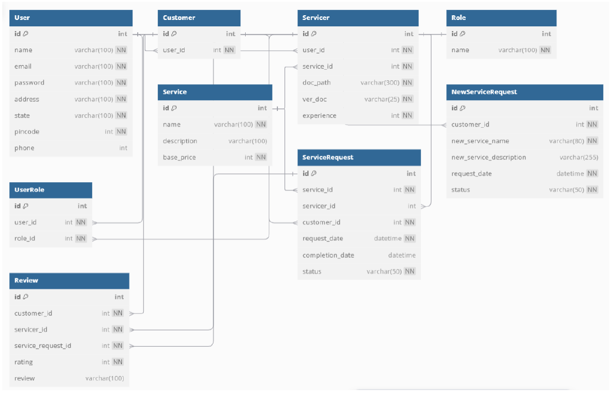

# Home Ease

## Project Overview  
**Home Ease** is a multi-user platform designed to provide comprehensive home servicing and solutions. It simplifies interactions between customers, service professionals, and administrators, streamlining service requests and management in one place.

---

## Technologies Used

- **Backend:** Flask — server-side logic and request handling  
- **Templating:** Jinja2 — dynamic HTML templates  
- **Database:** SQLAlchemy — database management and queries  
- **Frontend:** HTML & Bootstrap — responsive and user-friendly UI  
- **Utilities:**  
  - OS Module — file handling  
  - Datetime Module — date and time management  

---

## Core Functionalities

1. **User Authentication:**  
   - Login and registration for multiple user types: Customers, Service Professionals, and Admins.

2. **Admin Dashboard:**  
   - Manage users, including approving, rejecting, or blocking service professionals.

3. **Service Management:**  
   - Admins can create, update, and delete available services.

4. **Service Requests:**  
   - Customers can create, edit, and close service requests.

5. **Search Functionality:**  
   - Customers can search for services.  
   - Admins can manage and search service professionals.

6. **Service Actions:**  
   - Service professionals can view service requests, accept or reject them, and mark requests as completed.

---

## Database Schema

---

## Summary  
This platform acts as a bridge connecting users, service professionals, and admins to deliver seamless home service experiences.

